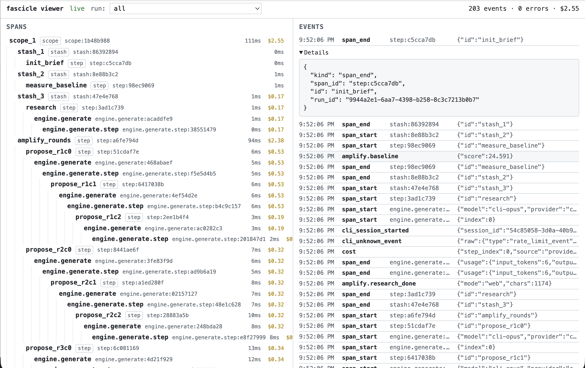

# Fascicle



Compose agents out of LLM calls, tool calls, and plain functions. Everything is a `Step<i, o>`. Wire steps together with 18 primitives (`sequence`, `parallel`, `branch`, `retry`, `loop`, `ensemble`, `checkpoint`, …) and run them as plain values. One `generate` surface fronts seven provider adapters: Anthropic, OpenAI, Google, OpenRouter, Ollama, LM Studio, and a `claude_cli` subprocess that drives the Claude Code CLI.

No framework lifecycle. No ambient state. No decorators. Adapters are passed in per run.

## Install

```bash
pnpm add fascicle zod
```

Provider SDKs are optional peers — install only the ones you use. See [docs/providers.md](./docs/providers.md).

## A 60-second tour

```typescript
import { run, sequence, step } from 'fascicle';

const flow = sequence([
  step('add', (n: number) => n + 1),
  step('double', (n: number) => n * 2),
]);

await run(flow, 1); // 4
```

Add a model call:

```typescript
import { create_engine, model_call, run, sequence, step } from 'fascicle';

const engine = create_engine({
  providers: { anthropic: { api_key: process.env.ANTHROPIC_API_KEY! } },
});

const flow = sequence([
  step('brief', (topic: string) => `Write a 2-sentence brief on: ${topic}`),
  model_call({ engine, model: 'sonnet', system: 'No preamble.' }),
  step('extract', (r) => r.content),
]);

try {
  console.log(await run(flow, 'Rust ownership'));
} finally {
  await engine.dispose();
}
```

`model_call` is the only sanctioned bridge between composition and the engine. It threads `ctx.abort`, `ctx.trajectory`, and streaming chunks for you.

## What's in the box

**Composition primitives (18).** Every composer takes `Step<i, o>` and returns `Step<i, o>`. Anything that fits a step fits any composition of steps.

| Primitive | Shape |
| --- | --- |
| `step` | lift a plain function into `Step<i, o>` |
| `sequence` | run A then B then C, threading the value |
| `parallel` | run a named map of steps concurrently |
| `branch` | route on a predicate of the input |
| `map` | run a step per array element, optional concurrency cap |
| `pipe` | post-process an inner step's output with a plain function |
| `retry` | re-run on failure with exponential backoff |
| `fallback` | run a backup if the primary throws |
| `timeout` | cancel an inner step after N ms |
| `loop` | bounded iteration with carry-state and an optional convergence guard |
| `compose` | label a composite so it shows up by intent in trajectories |
| `adversarial` | build, critique, repeat until accept or `max_rounds` |
| `ensemble` | run N members, pick the highest-scoring result |
| `tournament` | single-elimination bracket |
| `consensus` | run N concurrently, accept only if `>= quorum` agree |
| `checkpoint` | memoize an inner step by key in a `CheckpointStore` |
| `suspend` | pause for external input; resume later with `resume_data` |
| `scope` / `stash` / `use` | named state across non-adjacent steps |

Plus `run`, `run.stream`, and `describe`.

**AI engine.** `create_engine(config)` returns one `generate` surface across seven providers. Aliases (`sonnet`, `opus`, `gpt-4o`, `cli-sonnet`, …) resolve to `provider:model_id`. Reasoning effort (`'low' | 'medium' | 'high'`) is translated per provider. Cost estimation uses a pricing table with per-engine overrides.

**Adapters injected per run.**

```typescript
import { filesystem_logger } from '@repo/observability';
import { filesystem_store } from '@repo/stores';

await run(flow, input, {
  trajectory: filesystem_logger({ output_path: '.trajectory.jsonl' }),
  checkpoint_store: filesystem_store({ root_dir: '.checkpoints' }),
});
```

`run.stream(flow, input)` returns `{ events, result }` for incremental observation.

## Provider matrix

| Provider     | Peer dep                      | Auth                |
| ------------ | ----------------------------- | ------------------- |
| `anthropic`  | `@ai-sdk/anthropic`           | API key             |
| `openai`     | `@ai-sdk/openai`              | API key             |
| `google`     | `@ai-sdk/google`              | API key             |
| `openrouter` | `@openrouter/ai-sdk-provider` | API key             |
| `ollama`     | `ai-sdk-ollama`               | local `base_url`    |
| `lmstudio`   | `@ai-sdk/openai-compatible`   | local `base_url`    |
| `claude_cli` | none (spawns `claude`)        | OAuth or API key    |

Full details: [docs/providers.md](./docs/providers.md). The `claude_cli` adapter has its own guide: [docs/cli.md](./docs/cli.md).

## Live dev dashboard



The `fascicle-viewer` bin ships with the umbrella package. Point it at a trajectory file and it opens a browser tree of spans, errors, and emits as the run executes:

```bash
pnpm dlx fascicle-viewer .trajectory.jsonl
```

Or embed it programmatically:

```typescript
import { start_viewer } from 'fascicle';

const handle = await start_viewer({ port: 4242 });
// later
await handle.close();
```

For zero-latency streaming from inside a long-running flow, pair it with `http_logger` from `@repo/observability`. See [packages/viewer/README.md](./packages/viewer/README.md) for the full transport story.

## Where to go next

- [docs/getting-started.md](./docs/getting-started.md) — install and run your first flow
- [docs/concepts.md](./docs/concepts.md) — step-as-value, trajectories, cancellation
- [docs/configuration.md](./docs/configuration.md) — engine config, aliases, pricing, retries
- [docs/providers.md](./docs/providers.md) — per-provider adapter notes
- [docs/cli.md](./docs/cli.md) — the `claude_cli` subprocess adapter
- [docs/cookbook.md](./docs/cookbook.md) — retries, fan-out, judges, HITL, tool loops
- [docs/writing-a-harness.md](./docs/writing-a-harness.md) — building a runner around fascicle
- [examples/](./examples/) — runnable reference flows
- [packages/viewer/README.md](./packages/viewer/README.md) — viewer details and transport options

## Contributing

Fascicle is early and not accepting outside pull requests yet. Bug reports and feature ideas via GitHub Issues are welcome. See [CONTRIBUTING.md](./CONTRIBUTING.md).

## Development

This repo is a pnpm workspace. Internally the code is split into `@repo/core`, `@repo/engine`, `@repo/observability`, `@repo/stores`, and `@repo/fascicle` (umbrella). Only the umbrella reaches npm as `fascicle`. The split exists to enforce architectural boundaries (e.g. `@repo/core` cannot import adapters; only `@repo/config` reads `process.env`); fallow and the ast-grep rules in `rules/` police them.

```bash
pnpm install
pnpm check        # types, lint, structural rules, dead-code, tests, docs, spell
pnpm check:all    # adds Stryker mutation testing (slow; final gate)
```

`pnpm check` is the single source of truth for "is this done?". Output lands in `.check/` (one JSON per check). See [AGENTS.md](./AGENTS.md) for the full contract and [CLAUDE.md](./CLAUDE.md) for Claude-specific notes.

## License

[Apache 2.0](./LICENSE)
