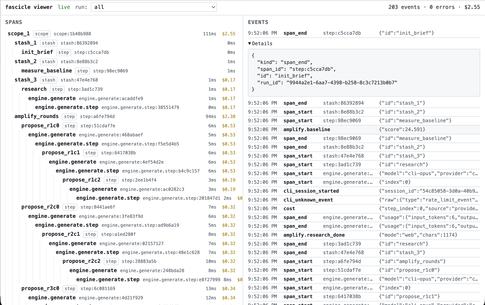

# Fascicle



Compose agents out of LLM calls, tool calls, and plain functions. Everything is a `Step<i, o>`. Wire steps together with 22 primitives (`sequence`, `parallel`, `chain`, `branch`, `retry`, `loop`, `ensemble_step`, `checkpoint`, …) and run them as plain values. One `generate` surface fronts eight provider adapters: Anthropic, OpenAI, Google, OpenRouter, AWS Bedrock, Ollama, LM Studio, and a `claude_cli` subprocess that drives the Claude Code CLI.

No framework lifecycle. No ambient state. No decorators. Adapters are passed in per run.

## Install

```bash
pnpm add fascicle
```

Fascicle is ESM-only and requires Node >= 24. `ai`, `zod`, and every provider SDK are optional peers — install only the ones you use. `pnpm add fascicle` alone builds and runs a flow against `transport: 'native'` or `claude_cli`, with no AI SDK package and no schema library installed at all; schemas accept any [Standard Schema](https://standardschema.dev) — zod, ArkType, Valibot, whichever you already use. See [docs/providers.md](./docs/providers.md).

No API key on hand? Several runnable examples need zero keys: [examples/hello.ts](./examples/hello.ts), [examples/suspend_resume.ts](./examples/suspend_resume.ts), and [examples/viewer_demo.ts](./examples/viewer_demo.ts) use no engine at all, and [examples/newsroom.ts](./examples/newsroom.ts) runs the full vocabulary against the bundled stub engine from `fascicle/testing`.

## A 60-second tour

<!-- snippet: check -->
```typescript
import { run, sequence, step } from 'fascicle';

const flow = sequence([
  step('add', (n: number) => n + 1),
  step('double', (n: number) => n * 2),
]);

await run(flow, 1); // 4
```

Add a model call:

<!-- snippet: check -->
```typescript
import { create_engine, model_step, run, sequence, step } from 'fascicle';

const engine = create_engine({
  providers: {
    anthropic: { api_key: process.env.ANTHROPIC_API_KEY!, transport: 'native' },
  },
});

const flow = sequence([
  step('brief', (topic: string) => `Write a 2-sentence brief on: ${topic}`),
  model_step({ engine, model: 'claude-sonnet-4-6', system: 'No preamble.' }),
]);

try {
  console.log(await run(flow, 'Rust ownership'));
} finally {
  await engine.dispose();
}
```

`transport: 'native'` keeps the zero-peer promise above: raw HTTP against the Messages API, nothing to install beyond `fascicle`. Drop it to use the default `ai_sdk` transport, which needs `pnpm add ai @ai-sdk/anthropic`.

`model_step` returns the model's answer (a `string`, or the schema-validated value when `schema` is set), keeping flows at the `step, step, model_step, step` cadence. Underneath sits `model_call`, the only sanctioned bridge between composition and the engine: same config, but it returns the full `GenerateResult` envelope (usage, cost, tool calls, finish reason), with an optional `project` to map a slice of it at the source. Both thread `ctx.abort`, `ctx.trajectory`, and streaming chunks for you.

## What's in the box

**Composition primitives.** Every composer takes `Step<i, o>` and returns `Step<i, o>`. Anything that fits a step fits any composition of steps. The everyday surface is small; most flows are built entirely from these nine:

| Primitive | Shape |
| --- | --- |
| `step` | lift a plain function into `Step<i, o>` |
| `sequence` | run A then B then C, threading the value |
| `parallel` | run a named map of steps concurrently |
| `branch` | route on a predicate of the input |
| `map` | run a step per array element, optional concurrency cap |
| `pipe` | post-process an inner step's output with a plain function |
| `retry` | re-run on failure with exponential backoff |
| `model_step` | the model's answer as a step (`model_call` projected to its content) |
| `chain` | named steps over a typed record: `.step` binds, `.stage` concludes a phase, `.output` projects |

The remaining primitives are specialized composers with the same contract, so they drop into any flow when the task calls for them: control flow (`loop`, `fallback`, `timeout`, `compose`), multi-model orchestration (`adversarial`, `ensemble_step`, `consensus`), and durability (`checkpoint`, `suspend`). Behind those sits an advanced tier — the pick-best variants `ensemble` and `tournament`, the raw named-state primitives `scope` / `stash` / `use` underlying `chain`, and the self-improvement pair `improve` / `learn` — covered in [docs/advanced-composition.md](./docs/advanced-composition.md), each entry paired with the primary primitive to try first. One-liners for all of them live in [docs/composition.md](./docs/composition.md), full shapes in [docs/api-reference.md](./docs/api-reference.md), and [docs/leaf-arm-spine.md](./docs/leaf-arm-spine.md) is the decision guide for which layer each belongs to.

Plus `run`, `run.stream`, and `describe`. And inside any step body, `ctx.call(step, input)` runs another Step with spans, abort, and error paths intact: the direct-style counterpart to composing, for control flow too dynamic to declare.

**AI engine.** `create_engine(config)` returns one `generate` surface across eight providers. Two axes: `model` is an opaque id sent to the provider verbatim (`claude-opus-4-8`, `gpt-4o`, `us.anthropic.claude-sonnet-4-20250514-v1:0`), and `provider` names the transport (`anthropic`, `bedrock`, `openrouter`, `claude_cli`, …) — swap `provider` to move a call between transports. Reasoning effort (`'none'` through `'max'`) is translated per provider. Cost estimation uses a pricing table with per-engine overrides.

The engine core is SDK-agnostic: providers plug in behind a neutral single-turn seam, as one of three kinds. Most built-ins wrap Vercel's AI SDK (`ai_sdk`). Five providers can instead run `transport: 'native'` (raw HTTP, no AI SDK in the path, no peer to install) — `anthropic` on the Messages API, `openai`/`openrouter`/`lmstudio` on a shared OpenAI Chat Completions core, and `ollama` on its own `/api/chat` endpoint. The third kind is `claude_cli`, which delegates to an external agent. All inherit the same tool loop, retry, cost, and trajectory, and `custom_providers` registers your own adapter of any kind without touching Fascicle. See [docs/providers.md](./docs/providers.md).

**Adapters injected per run.** Trajectory loggers and checkpoint stores ship under the `fascicle/adapters` subpath:

```typescript
import { filesystem_logger, filesystem_store } from 'fascicle/adapters';

await run(flow, input, {
  trajectory: filesystem_logger({ output_path: '.trajectory.jsonl' }),
  checkpoint_store: filesystem_store({ root_dir: '.checkpoints' }),
});
```

`filesystem_logger` writes synchronously (each event blocks the event loop briefly), which is fine for dev tools and short-lived runs; see [docs/concepts.md](./docs/concepts.md#adapter-limits) before wiring it into a long-running server. Span parentage is threaded through the runner, so span trees stay correct under `parallel`/`map` concurrency. The `TrajectoryLogger` and `CheckpointStore` contracts (exported from `fascicle`) are tiny — roll your own to push events to Honeycomb, S3, and so on.

`run.stream(flow, input)` returns `{ events, result }` for incremental observation, and `run.until_suspended(flow, input)` drives human-in-the-loop flows: a `suspend` gate resolves to a typed outcome with a `resume` closure instead of throwing.

**Stub engines for tests.** The `fascicle/testing` subpath ships the two doubles an app needs — `make_stub_engine` routes canned responses by the system prompt's stable first line and validates them through the call's own schema, `make_capture_engine` records every `GenerateOptions` for assertions — so tests run the real flow through the real `run()` with zero network and no mocking framework:

```typescript
import { make_stub_engine } from 'fascicle/testing';

const engine = make_stub_engine([
  { prefix: 'myapp/reviewer', content: { findings: [], summary: 'clean' } },
]);
```

**Markdown-defined agents.** When an agent is just a prompt plus an output schema, `define_agent` (the `fascicle/agents` subpath) folds a markdown file (frontmatter `name` / `model` / `temperature`, with the body as the prompt) and a zod schema into a `Step<i, o>`:

<!-- snippet: check -->
```typescript
import { z } from 'zod';
import { create_engine } from 'fascicle';
import { define_agent } from 'fascicle/agents';

const engine = create_engine({ providers: { claude_cli: { auth_mode: 'oauth' } } });

const reviewer = define_agent({
  md_path: new URL('./prompts/reviewer.md', import.meta.url),
  schema: z.object({ findings: z.array(z.string()), summary: z.string() }),
  engine,
});
```

This is the [blueprint's](./docs/blueprint.md) recommended shape for simple one-prompt agents; reference agents built on it (reviewer, documenter, researcher) live in [examples/agents/](./examples/agents/).

**MCP bridge.** The `fascicle/mcp` subpath connects flows to the Model Context Protocol both ways. `mcp_client` turns an external MCP server's tools into plain `Tool[]`; `serve_flow` exposes a composed flow as an MCP tool to hosts like Claude Desktop or Cursor. It is pure adapter glue over the existing `Tool` and `run` contracts, and `@modelcontextprotocol/sdk` is an optional peer you only install when you use it.

<!-- snippet: check -->
```typescript
import { McpServer } from '@modelcontextprotocol/sdk/server/mcp.js';
import { z } from 'zod';
import { step } from 'fascicle';
import { mcp_client, serve_flow } from 'fascicle/mcp';

// Consume an external MCP server's tools inside a flow.
const remote = await mcp_client({ transport: 'stdio', command: 'my-mcp-server' });
console.log(remote.tools.map((t) => t.name));
await remote.close();

// Expose a composed flow as an MCP tool on your own server.
const server = new McpServer({ name: 'my-app', version: '1.0.0' });
serve_flow({
  server,
  flow: step('greet', (input: { name: string }) => `Hello, ${input.name}!`),
  name: 'greet',
  description: 'Greet a person by name.',
  input_schema: z.object({ name: z.string() }),
});
```

## Provider matrix

| Provider     | Peer dep                      | Auth                |
| ------------ | ----------------------------- | ------------------- |
| `anthropic`  | `ai` + `@ai-sdk/anthropic`, or none with `transport: 'native'` | API key |
| `openai`     | `ai` + `@ai-sdk/openai`, or none with `transport: 'native'` | API key |
| `google`     | `ai` + `@ai-sdk/google`       | API key             |
| `openrouter` | `ai` + `@openrouter/ai-sdk-provider`, or none with `transport: 'native'` | API key |
| `bedrock`    | `ai` + `@ai-sdk/amazon-bedrock` | `region` + AWS credentials |
| `ollama`     | `ai` + `ai-sdk-ollama`, or none with `transport: 'native'` | local `base_url` |
| `lmstudio`   | `ai` + `@ai-sdk/openai-compatible`, or none with `transport: 'native'` | local `base_url` |
| `claude_cli` | none (spawns `claude`)        | OAuth or API key    |

Full details: [docs/providers.md](./docs/providers.md). The `claude_cli` adapter has its own guide: [docs/cli.md](./docs/cli.md).

## Live dev dashboard



The `fascicle-viewer` bin ships with the umbrella package (there is no separate `fascicle-viewer` package). Point it at a trajectory file and it opens a browser tree of spans, errors, and emits as the run executes:

```bash
# installed locally:
pnpm exec fascicle-viewer .trajectory.jsonl
# or one-off via the umbrella package:
pnpm dlx --package=fascicle fascicle-viewer .trajectory.jsonl
```

Or embed it programmatically:

<!-- snippet: check -->
```typescript
import { start_viewer } from 'fascicle/viewer';

const handle = await start_viewer({ port: 4242 });
// later
await handle.close();
```

For zero-latency streaming from inside a long-running flow, pair it with `http_logger` from `fascicle/adapters`. See [docs/viewer.md](./docs/viewer.md) for the full transport story.

## Building an app on Fascicle

**[docs/blueprint.md](./docs/blueprint.md) is the recommended architecture for apps built on Fascicle** — distilled from the reference apps and production consumers. One composition layer (`flow.ts`) that holds the whole topology, `create_engine` confined to one file, prompts as markdown with frontmatter, zod schemas as the stage contracts, stub-engine testing, and [ast-grep rules](./examples/pr-improve/rules/) that turn each boundary into a build failure. If you are a coding agent scaffolding a new Fascicle app, follow the blueprint and its checklist.

The canonical worked example is [examples/pr-improve/](./examples/pr-improve/), with its design rationale in [examples/pr-improve/docs/architecture.md](./examples/pr-improve/docs/architecture.md).

## Where to go next

- [docs/blueprint.md](./docs/blueprint.md) — **the agent blueprint**: the standard app architecture (start here when building an app)
- [docs/getting-started.md](./docs/getting-started.md) — install and run your first flow
- [docs/concepts.md](./docs/concepts.md) — step-as-value, trajectories, cancellation
- [docs/composition.md](./docs/composition.md) — full composition surface: the 22 primitives, run/stream, checkpointing
- [docs/leaf-arm-spine.md](./docs/leaf-arm-spine.md) — the three-layer shape of a Fascicle flow and how to choose the right primitive at each layer
- [docs/advanced-composition.md](./docs/advanced-composition.md) — the primitives to reach for last (`scope`/`stash`/`use`, `ensemble`, `tournament`, `improve`/`learn`) and when they earn their keep
- [docs/api-reference.md](./docs/api-reference.md) — the public surface at a glance
- [docs/configuration.md](./docs/configuration.md) — engine config, defaults, pricing, retries
- [docs/providers.md](./docs/providers.md) — per-provider adapter notes
- [docs/cli.md](./docs/cli.md) — the `claude_cli` subprocess adapter
- [docs/cookbook.md](./docs/cookbook.md) — retries, fan-out, judges, HITL, tool loops
- [docs/deliberation-as-composition.md](./docs/deliberation-as-composition.md) — how ensembles, tournaments, consensus, and adversarial loops decompose into the primitives
- [docs/testing.md](./docs/testing.md) — testing flows with stub, script, and capture engines
- [docs/regression-testing-model-behavior.md](./docs/regression-testing-model-behavior.md) — regression-testing model behavior with mutation-tested judges and a committed score baseline
- [docs/human-in-the-loop.md](./docs/human-in-the-loop.md) — suspend/resume approval over HTTP and streaming to a `useChat` UI via `fascicle/ui`
- [docs/writing-a-harness.md](./docs/writing-a-harness.md) — building a runner around Fascicle
- [docs/embedding-under-a-harness.md](./docs/embedding-under-a-harness.md) — running a Fascicle agent as somebody's child process
- [docs/troubleshooting.md](./docs/troubleshooting.md) — first-run errors and what they mean
- [docs/comparison.md](./docs/comparison.md) — how Fascicle compares to LangChain, Mastra, and others
- [docs/adoption-decision.md](./docs/adoption-decision.md) weighs whether to adopt Fascicle: the honest case, the risks, and when to reach for something else
- [docs/roadmap.md](./docs/roadmap.md) — what has shipped, what is being considered, and what Fascicle deliberately will not do
- [examples/](./examples/) — runnable reference flows; start with [examples/newsroom.ts](./examples/newsroom.ts), the vocabulary tour
- [docs/viewer.md](./docs/viewer.md) — viewer details and transport options
- [docs/grafana.md](./docs/grafana.md) — shipping a run's traces and metrics to a Grafana dashboard over OpenTelemetry

## Contributing

Fascicle is early and not accepting outside pull requests yet. Bug reports and feature ideas via GitHub Issues are welcome. See [CONTRIBUTING.md](./CONTRIBUTING.md).

## Development

This repo is a **single package**. The code is organized as deep modules under `src/` (`core`, `engine`, `composites`, `agents`, `adapters`, `mcp`, `stdio`, `ui`, `otel`, `policy`, `schema`, `testing`, `viewer`), each reachable only through its barrel via the `#<module>` import alias. The umbrella surface at the `src/` root is what publishes to npm as `fascicle`. Architectural boundaries (for example, core cannot import adapters, engine imports core type-only, and no `process.env` outside the audited exceptions) are enforced by the ast-grep rules in `rules/` and a directory-level boundary DAG in `fallow.toml`. The 7 apps under `examples/*/` are separate workspace members that consume the library via `fascicle: workspace:*`.

```bash
pnpm install
pnpm check        # types, lint, structural rules, dead-code, tests, docs, spell
pnpm check:all    # adds Stryker mutation testing + the packaging gate (final gate)
```

`pnpm check` is the single source of truth for "is this done?". Output lands in `.check/` (one JSON per check). See [AGENTS.md](./AGENTS.md) for the full contract and [CLAUDE.md](./CLAUDE.md) for Claude-specific notes.

## License

[Apache 2.0](./LICENSE)
