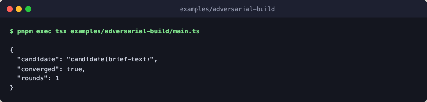

# adversarial-build

The build-and-critique pattern with ensemble judging. A candidate is produced,
a critique judges it, and the loop repeats until the critique accepts. Here
the critique is an ensemble of judges that each score the candidate, and the
best-scoring verdict wins.



Every step is a deterministic stub, so the example runs with no engine layer,
no network, and no LLM calls.

## Run

```bash
pnpm exec tsx examples/adversarial-build/main.ts
```
