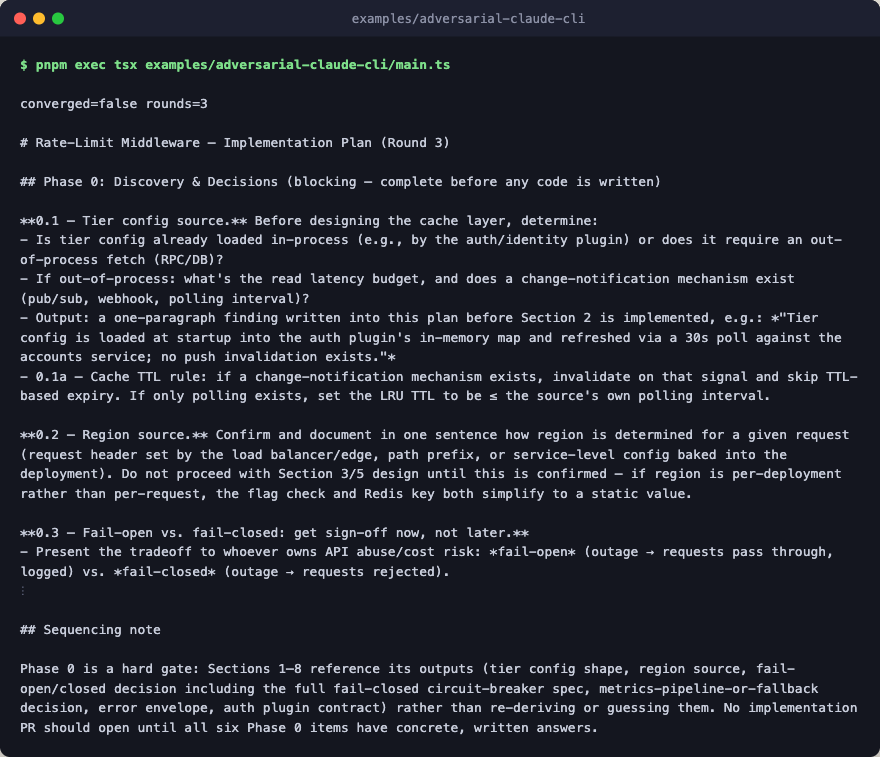

# adversarial-claude-cli

A PRD goes in, an implementation plan comes out, and a critic drives the loop.
The whole flow runs through the `claude_cli` subprocess provider: a builder
step turns the PRD into a draft plan, and a critic step inspects the plan
against a zod-validated verdict schema. When the critic fails a draft, the
builder gets the original PRD, the previous draft, and the critic's notes for
the next round. The loop runs up to `max_rounds` times, or until the critic
returns `verdict: 'pass'`.



Two layers are worth pointing out. `model_step` accepts `string | Message[]`,
and the `adversarial` primitive feeds the build step `{ input, prior?, critique? }`
instead, so a `compose_build_prompt` step sits in front of `model_step` to
flatten that record into a prompt string. The critic returns structured output
via `--json-schema`: the CLI provider compiles `critique_schema` to JSON
Schema, forwards it, and parses the reply, with one automatic repair round
before a second failure throws `schema_validation_error`.

## Flow

```text
adversarial                       compose: a PRD in, a critic-approved plan out
└─ loop                           up to 3 rounds, until the critic passes
   ├─ scope                       one build round: a new or revised draft
   │  ├─ stash                    keep the loop state for later in the round
   │  │  └─ snapshot              pass the state through unchanged
   │  ├─ to_build_input           give build the PRD, last draft, and notes
   │  ├─ sequence                 the build step: prompt first, then the model
   │  │  ├─ compose_build_prompt  pure: flatten the record into one prompt
   │  │  └─ build                 claude_cli sonnet drafts or revises the plan
   │  └─ use                      fold the new draft into the state
   └─ guard  scope                critique the draft and decide whether to stop
      ├─ stash                    keep the loop state for later in the round
      │  └─ snapshot              pass the state through unchanged
      ├─ extract_candidate        pull the draft out of the state
      ├─ critic                   claude_cli haiku returns a zod-checked verdict
      └─ use                      stop on pass, keep the notes for next round
```

Everything except the build `sequence` and the `critic` step is plumbing that
`adversarial` builds from core primitives.

## Run

No API key is required: the `claude_cli` provider piggybacks on your existing
`claude login` session. Make sure `claude` is on PATH.

```bash
pnpm exec tsx examples/adversarial-claude-cli/main.ts
pnpm exec tsx examples/adversarial-claude-cli/main.ts "your PRD here"
```
