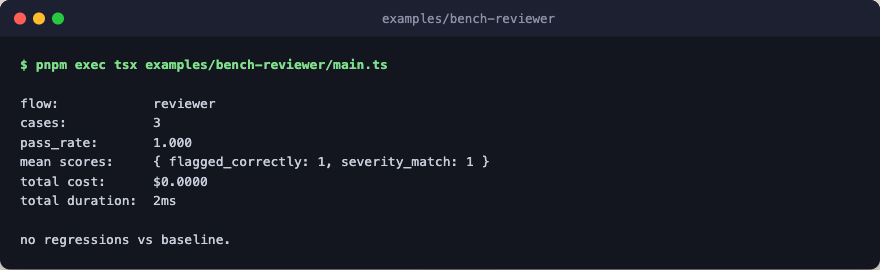

# bench-reviewer

Drives the `bench` primitive against the markdown-defined `reviewer` agent.
Cases come from `bench/reviewer/cases.json` at the repo root, so the example
file stays focused on the wiring. Two judges score each case: one checks that
at least one finding's category matches the expected category, and the other
checks that the worst finding's severity matches the expected severity.



The engine is a stub that returns canned, schema-conforming findings keyed by
case id. Swap `make_stub_engine` for `create_engine({...})` to drive the same
flow against a real provider. The agent definition itself is demo code in
[`../agents/`](../agents/); copy it alongside this example when porting it
into your own project.

## Run

```bash
WRITE_BASELINE=1 pnpm exec tsx examples/bench-reviewer/main.ts
pnpm exec tsx examples/bench-reviewer/main.ts
```

The first command records a baseline. Subsequent runs compare against
`bench/reviewer/baseline.json` and exit 1 on regression.
