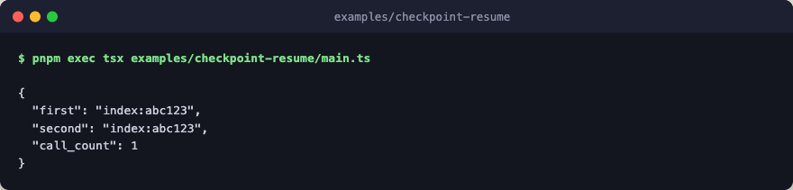

# checkpoint-resume

Memoize an expensive step by key. The first run misses the cache, executes
`inner`, and persists the result to the filesystem store; the second run hits
the cache, skips `inner`, and returns the stored value. A shared counter
proves the skip.



The example writes to a fresh temp directory, so it is hermetic and can run
repeatedly without stale state. Every step is a deterministic stub: no engine
layer, no network, no LLM calls.

## Run

```bash
pnpm exec tsx examples/checkpoint-resume/main.ts
```
