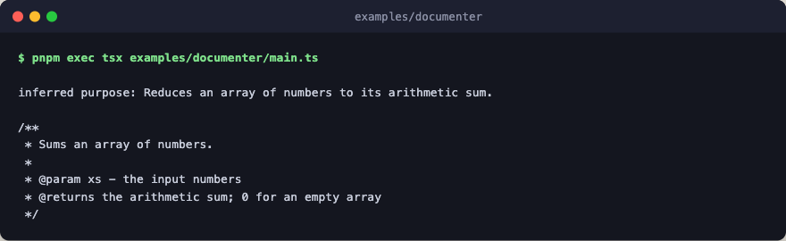

# documenter

Generate documentation for a single function literal against a stubbed
engine. The markdown-defined `documenter` agent accepts either a file or a
symbol target and threads the requested style through. The engine here is a
stub that returns a canned, schema-conforming doc; swap it for
`create_engine({...})` to run against a real provider.



The agent definition itself is demo code in [`../agents/`](../agents/); copy
it alongside this example when porting it into your own project.

## Run

```bash
pnpm exec tsx examples/documenter/main.ts
```
