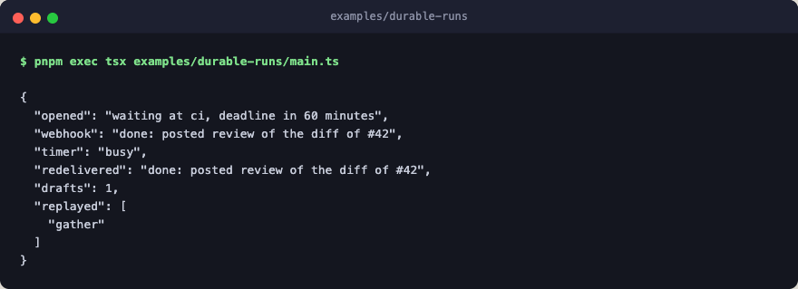

# durable-runs

A flow that waits on outside events, driven one event at a time the way a
webhook handler or a queue worker would drive it. `durable` keeps the run in a
store between events, so no process has to stay up while the run waits.



Each event builds its own driver and its own copy of the flow over one
`filesystem_store`, which is what a fresh process would do:

1. A pull request opens and starts the run. It fetches the diff, drafts a
   review inside a checkpoint, and stops at the CI gate with an hour's
   deadline.
2. The CI webhook resumes the run. While that drive is still posting the
   review, the deadline timer fires, finds the run held, and reports `busy`.
   Only one decision ever reaches the gate.
3. A redelivered webhook finds the run done and changes nothing.

The draft ran once across all three events, because its checkpoint served
every later drive. The diff fetch ran again on the webhook's drive, and the
trajectory reports it as a `step_replayed` event. That event is the cue to
wrap the fetch in a checkpoint too.

Every step is a deterministic stub: no engine layer, no network, no LLM calls.

## Flow

```text
review         sequence: review a pull request once CI reports
├─ gather      fetch the diff, a paid call this example leaves unprotected
├─ checkpoint  keep the draft, so no later event pays for it
│  └─ draft    draft the review, the expensive part
├─ ci          suspend: wait for CI, an hour at most
└─ post        post the result on the pull request
```

## Run

```bash
pnpm exec tsx examples/durable-runs/main.ts
```
