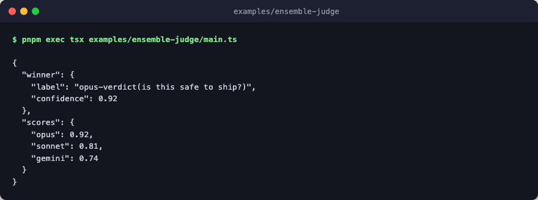

# ensemble-judge

Pick the best of N judges. Three stand-in judges score a shared input, and
the winner is the one with the highest confidence. This is the canonical
"N-of-M pick best" pattern.



Every step is a deterministic stub: no engine layer, no network, no LLM calls.

## Flow

```text
ensemble                       compose: highest confidence wins; all scores kept
└─ sequence
   ├─ parallel
   │  ├─ opus  judge_opus      stub verdict at confidence 0.92
   │  ├─ sonnet  judge_sonnet  stub verdict at confidence 0.81
   │  └─ gemini  judge_gemini  stub verdict at confidence 0.74
   └─ pick_winner              step
```

## Run

```bash
pnpm exec tsx examples/ensemble-judge/main.ts
```
