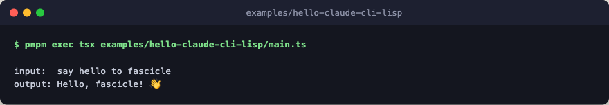

# hello-claude-cli-lisp

The same harness as [hello-claude-cli](../hello-claude-cli/), rewritten in a
Lisp-flavored style. Functionally identical, different shape.



The point is pedagogical: TypeScript is an expression language hiding inside
a statement language, and if you lean on that you can write something that
maps almost line-for-line onto Scheme. Each technique in [main.ts](./main.ts)
is annotated so you can see the correspondence, and the header comment
carries a Scheme shadow of the whole program to read alongside it.

## Run

```bash
pnpm exec tsx examples/hello-claude-cli-lisp/main.ts
pnpm exec tsx examples/hello-claude-cli-lisp/main.ts "your prompt here"
```
