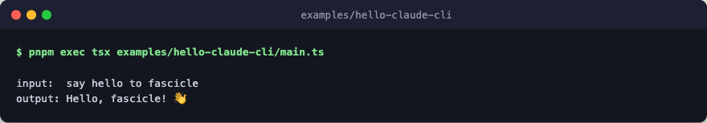

# hello-claude-cli

Your first Fascicle harness that calls a real model. It uses the `claude_cli`
subprocess provider, which spawns the `claude` binary and piggybacks on your
existing authenticated session. No API key is required as long as `claude` is
on PATH and you have run `claude login`.



Under `auth_mode: 'oauth'` the subprocess env inherits from `process.env`
automatically (opt out with `inherit_env: false`). Engine-level `defaults`
fill in `model` and `system`, so `model_call({ engine })` needs no extra
parameters.

## Flow

```text
sequence    ask claude once, then keep the reply text
├─ step     one claude_cli call, model and system from defaults
└─ extract  keep the reply text, or its JSON when not a string
```

## Run

```bash
pnpm exec tsx examples/hello-claude-cli/main.ts
pnpm exec tsx examples/hello-claude-cli/main.ts "your prompt here"
```
