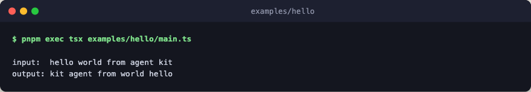

# hello

Your first Fascicle harness. Three steps compose into a flow, and one `run`
call executes it: no engine, no network, no API keys. This is the smallest
viable shape of a harness (a flow value, one run call, and a tiny surrounding
program).



## Run

```bash
pnpm exec tsx examples/hello/main.ts
pnpm exec tsx examples/hello/main.ts "your custom input here"
```
