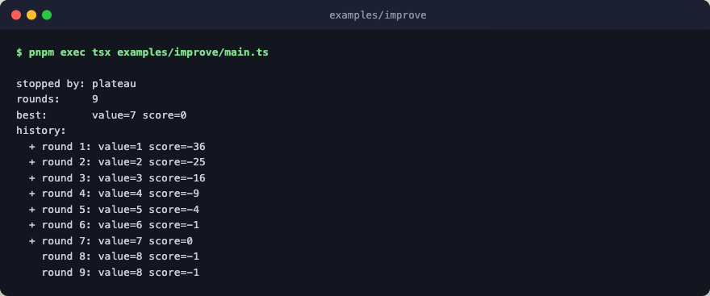

# improve

Bounded online self-improvement with a toy scoring function. The flow
optimizes a single integer toward a fixed target: the propose step walks
`parent + 1` each round, and the score step rewards proximity to the target
via `-(value - TARGET)^2`. Once the loop overshoots, plateau detection trips
and the run stops.



Every step is pure TypeScript: no engine layer, no network, no LLM calls.

## Run

```bash
pnpm exec tsx examples/improve/main.ts
```
