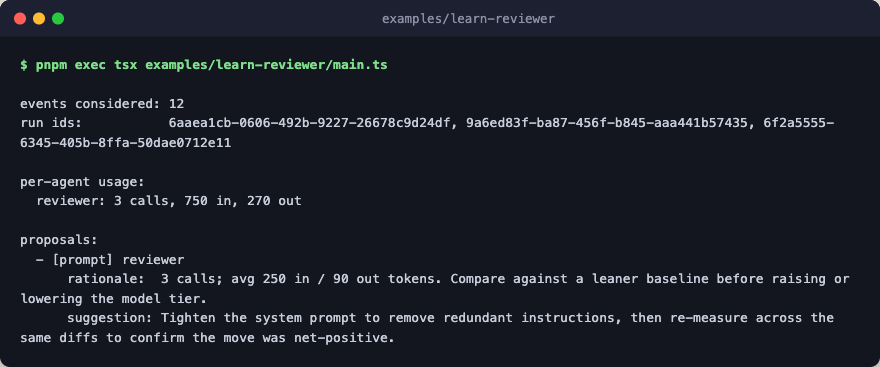

# learn-reviewer

An end-to-end demo that combines the `reviewer` agent with `learn`. First it
runs the markdown-defined `reviewer` agent on three hand-crafted diffs and
writes each run's trajectory to its own JSONL file via `filesystem_logger`.
Then it runs the `learn` composer over the directory of trajectories with a
pure-TypeScript analyzer that aggregates `agent.call` token usage and
proposes prompt-tightening improvements.



The engine is a stub that returns canned, schema-conforming findings, so the
demo proves the wiring without any API keys. Swap `make_stub_engine` for
`create_engine({...})` to drive the same flow against a real provider. The
agent definition itself is demo code in [`../agents/`](../agents/); copy it
alongside this example when porting it into your own project.

## Flow

```text
reviewer  one model call per diff, each run to its own jsonl

learn                          compose: recorded runs only, off the request path
└─ scope                       stash the meta, analyze, then wrap the result
   ├─ stash                    hold the event count and run ids for the end
   │  └─ learn_compute_meta    read the three jsonl files, count events and runs
   ├─ learn_build_input        pair the events with describe(reviewer)
   ├─ reviewer_usage_analyzer  pure: sum agent.call usage, propose prompt edits
   └─ use                      wrap proposals with the event count and run ids
```

## Run

```bash
pnpm exec tsx examples/learn-reviewer/main.ts
```
