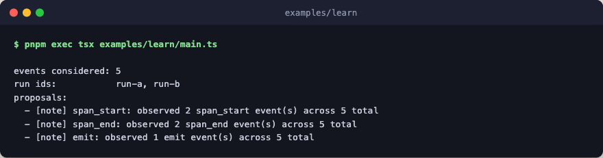

# learn

Offline self-improvement over a recorded trajectory. The example synthesizes
a tiny JSONL trajectory file in a temp directory, then runs `learn` with a
trivial analyzer that tallies events by kind and emits one "improvement"
proposal per kind.



The analyzer is pure TypeScript: no engine layer, no network, no LLM calls.

## Flow

```text
learn                        compose: analyze the recorded trajectory offline
└─ scope
   ├─ stash
   │  └─ learn_compute_meta  step
   ├─ learn_build_input      step
   ├─ tally                  pure: count events by kind, one note per kind
   └─ use
```

The studied `greet` step isn't in the tree, because `learn` never runs it and
only hands its `describe` text to the analyzer with the recorded events.

## Run

```bash
pnpm exec tsx examples/learn/main.ts
```
