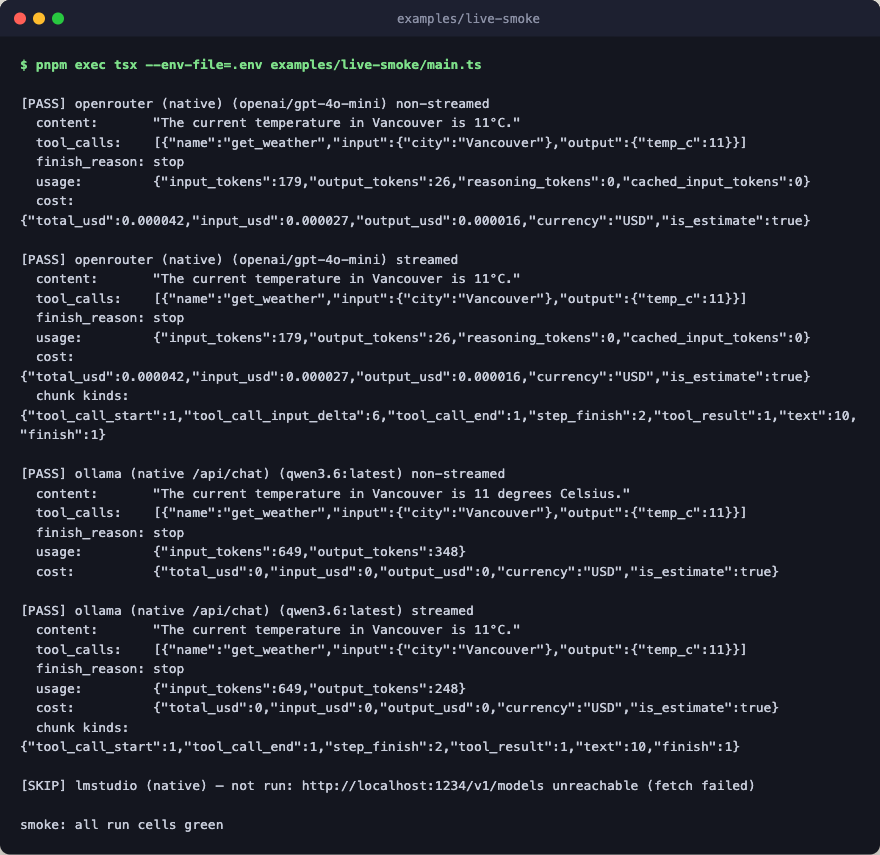

# live-smoke

The manual release gate against real provider wires. It runs one tool-loop
flow, streamed and non-streamed, across three native transports: `openrouter`
(hosted OpenAI-compatible chat/completions), `ollama` (the daemon's own
`/api/chat` NDJSON endpoint, not the `/v1` compat tail), and `lmstudio`
(LM Studio's OpenAI-compatible server on the raw-HTTP transport).



The tool itself is a deterministic in-memory lookup, so the only network
under test is the provider wire: request mapping, the tool-call round trip,
stream chunk shapes, and usage and cost accounting. Live network keeps this
out of the test suite; re-run it manually after any provider-seam change.

Each backend is availability-gated. A backend whose key is absent or whose
daemon is unreachable is skipped and reported not-run, never failed, because
the gate is "green where backends are available". The process exits non-zero
if a backend that actually ran had a failing cell, or if no backend was
available at all, because a gate that ran nothing has proved nothing.

## Flow

```text
live-smoke            openrouter, ollama, and lmstudio, narrowed by SMOKE_ONLY
├─ probe              no key or no daemon skips a backend, never fails it
└─ cell               each backend that answered, non-streamed then streamed
   ├─ model_call      the whole flow under test, a tool loop of up to 4 steps
   │  └─ get_weather  in-memory lookup, so only the provider wire is live
   └─ check_cell      tool output, finish reason, usage, cost, stream chunks
```

## Run

```bash
pnpm exec tsx --env-file=.env examples/live-smoke/main.ts
```

Prereqs, any subset (missing backends are skipped): `OPENROUTER_API_KEY`
exported or set in the root `.env`, an Ollama daemon with a tool-capable
model pulled, an LM Studio server with a tool-capable model loaded.
`SMOKE_ONLY` narrows the run to named backends, and the `SMOKE_*_MODEL`,
`SMOKE_*_BASE_URL`, and `SMOKE_*_TRANSPORT` variables override the defaults;
the header comment in [main.ts](./main.ts) lists them all.
