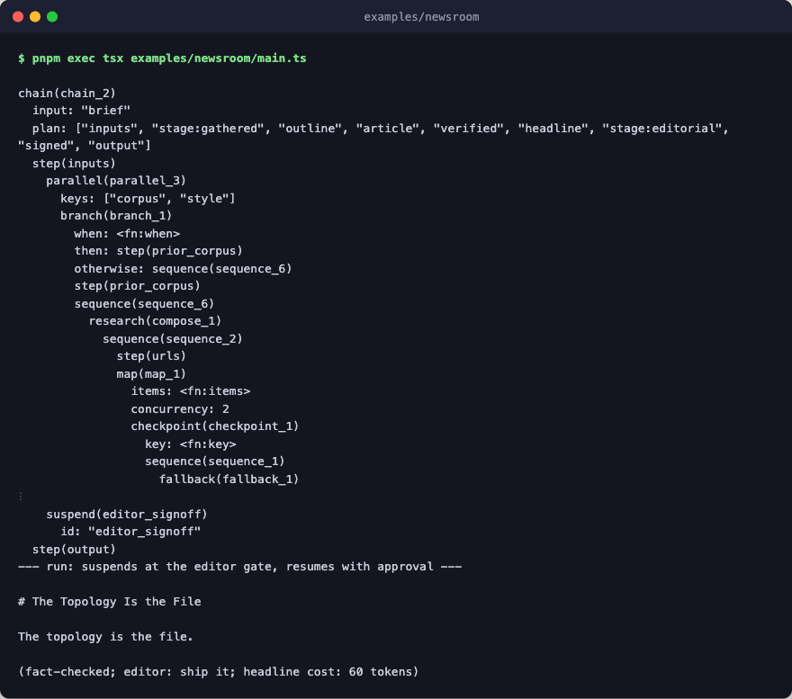

# newsroom

The vocabulary tour. A brief goes in, a signed-off article comes out, and
every primary primitive appears once, in its suggested role, visible in one
builder. This is a tour rather than a template: a real app needs the subset
its problem calls for ([docs/blueprint.md](../../docs/blueprint.md),
anti-pattern 8).



The shape is three layers: model boundaries as leaves (`model_step`, plus one
`model_call` where the shell wants the usage envelope), named arms composed
from primitives (hardening, selection, verification), and a `chain` spine
that sequences the arms with `ctx.call`, declaring each as `arm` metadata so
`describe` renders the full tree.

```text
chain 'brief'
  ├ inputs    ← parallel { corpus: branch(update? prior : research), style }
  │             research = sequence(urls → map(fetch hardened by
  │             retry/timeout/fallback, checkpoint per url) → widen loop)
  ├ stage 'gathered' (narrow the record)
  ├ outline   ← outliner (model_step)
  ├ article   ← adversarial(draft ensemble_step judged by a model, critique)
  ├ checked   ← consensus of three fact checkers
  ├ headline  ← model_call (the envelope carries usage for the cost line)
  ├ stage 'editorial'
  ├ signed    ← suspend (editor sign-off; resumed via run.until_suspended)
  └ output: render the article markdown
```

Some vocabulary is deliberately absent: `scope`/`stash`/`use` (the low-level
state primitives `chain` supersedes), `tournament` and plain `ensemble`
(pick-best variants; see [ensemble-judge](../ensemble-judge/)), and the
self-improvement pair `improve`/`learn` (see [improve](../improve/) and
[learn](../learn/), where `learn` runs over recorded trajectories, never in
the request path).

The example runs keyless against a stub engine routed by system-prompt
prefix. The run suspends at the editor gate, and `main` resumes it with
canned approval.

## Run

```bash
pnpm exec tsx examples/newsroom/main.ts
```
