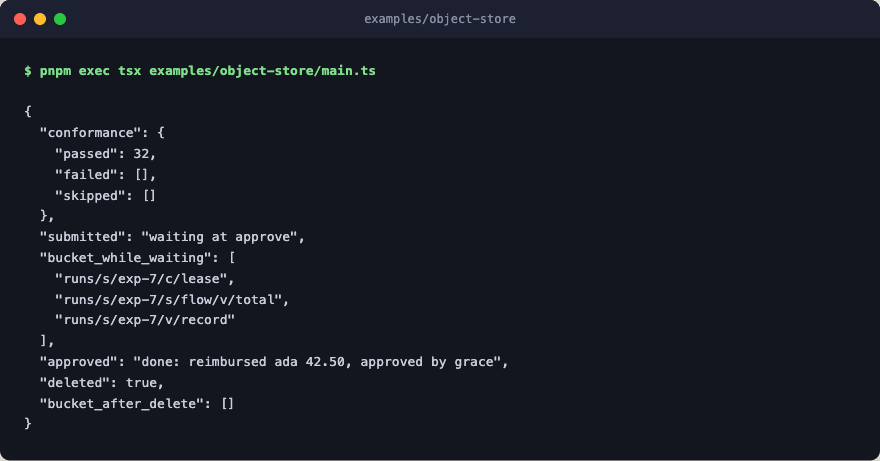

# object-store

A `CheckpointStore` written over an object-store client, with the scopes and
claims that `durable` needs, so a run that waits at a gate can live in a
bucket. The client is an in-memory fake with S3's shape, which makes the store
the part to copy. Swap in a real client and it works the same way.



## How the Store Works

Three parts of it are easy to get wrong, and the conformance suite checks each
one.

- **Keys.** A scope is a key prefix, and every name is percent-encoded before
  it joins one, dots included. Values, claims, and nested scopes each sit
  under a segment of their own (`v/`, `c/`, `s/`). So two names can't reach the
  same object however alike they look, and clearing scope `a` deletes what's
  under its own prefix and never touches a scope named `a/b`.
- **Claims.** A claim is an object that holds its owner and expiry. It's
  created with `If-None-Match: *` and replaced with `If-Match` on the ETag the
  claimer just read, so when claimers race, the bucket takes exactly one of
  their writes. A release overwrites the claim as expired, on the same
  condition, rather than deleting it, because a plain delete could erase a
  claim that another owner took in between.
- **Clear.** It lists the scope's prefix a page at a time and deletes each
  key, following the continuation the way every real listing needs.

`run_object_store()` runs `checkpoint_store_conformance` with a fresh bucket for
each check and a `corrupt` hook, so the damage check runs too, and
`test/examples.test.ts` holds it to no failures and nothing skipped. Then it
drives an expense report through `durable`:

1. The report comes in and starts the run. It totals the receipts inside a
   checkpoint and stops at the manager's approval. The bucket now holds the
   run's record, the checkpointed total, and the lease it released.
2. The approval arrives on a client and a driver of its own, the way a second
   process would bring it, and finishes the run.
3. Deleting the run clears its scope, and the bucket is empty again.

Every step is a deterministic stub: no engine layer, no network, no LLM calls.
A store over a real S3 client would also read its 409
`ConditionalRequestConflict` as a lost claim, the way this one reads a 412, and
it would hash any name long enough to push a key past S3's 1024-byte limit,
the way `filesystem_store` does.

## Flow

```text
expense        sequence: reimburse an expense report once a manager approves it
├─ checkpoint  keep the total in the bucket
│  └─ total    add up the receipts
├─ approve     suspend: wait for a manager to sign off
└─ reimburse   pay the employee back
```

## Run

```bash
pnpm exec tsx examples/object-store/main.ts
```
