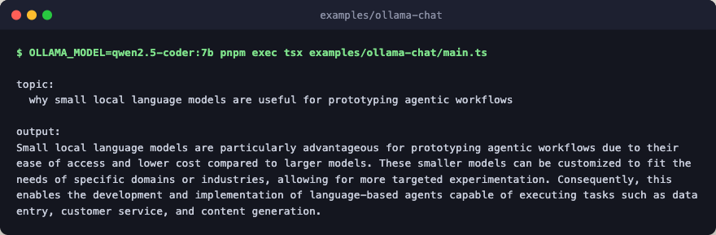

# ollama-chat

Drive a local Ollama model through the engine layer. The engine builds on the
`ollama` provider's zero-peer native transport (raw HTTP against the daemon's
own `/api/chat` endpoint, nothing beyond `fascicle` itself to install), then
composes two model boundaries as a sequence: draft, then refine. This proves
the engine and composition layers work against a real local model without any
API key.



## Run

Prereqs: an Ollama daemon running at `OLLAMA_HOST` (default
`http://localhost:11434`) and a model pulled, for example
`ollama pull llama3.2:3b` (about 2 GB on disk).

```bash
pnpm exec tsx examples/ollama-chat/main.ts
OLLAMA_MODEL=qwen2.5-coder:7b pnpm exec tsx examples/ollama-chat/main.ts
```

The second form points the example at any other model you already have
pulled.
