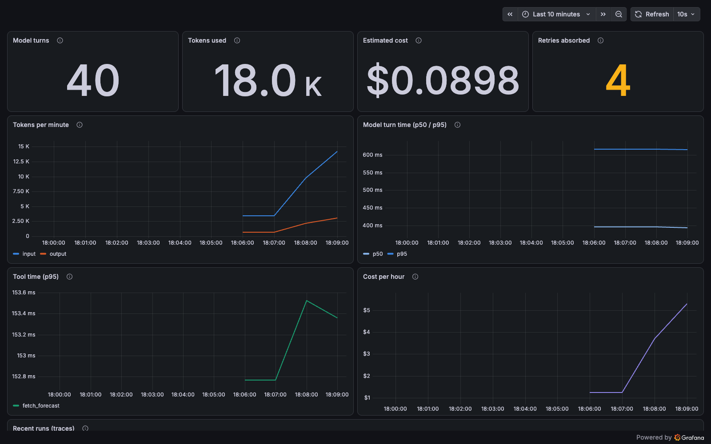
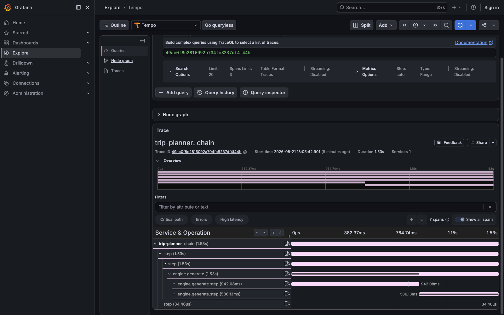

# otel-grafana

Watch an agent's traces and metrics on a Grafana dashboard. Everything
Fascicle knows about a run travels on one trajectory stream.
`create_otel_trajectory_logger` (from `fascicle/otel`) turns that stream into
OpenTelemetry spans and, with `metrics: true`, standard GenAI metric
instruments: token usage, model turn duration, tool duration, estimated cost,
and retries the engine absorbed. Register the OpenTelemetry SDK once at
startup, hand the logger to `run`, and any OTel-speaking backend can chart
the results; this example ships them to Grafana's all-in-one image.



The model is a canned in-process provider with pretend latency, token counts,
one tool call per run, and an occasional simulated rate limit, so no API key
is needed. Swapping in a real provider changes nothing: the logger observes
the run, not the provider.

## Run

Start the Grafana OTel stack (Docker), then run the example:

```bash
docker run --rm -p 3000:3000 -p 4318:4318 grafana/otel-lgtm
pnpm exec tsx examples/otel-grafana/main.ts
```

Then open <http://localhost:3000> and import
[dashboard.json](./dashboard.json) (Dashboards > New > Import).
[docs/grafana.md](../../docs/grafana.md) walks through every step in detail.

The traces land alongside the metrics: each run is one trace in Tempo, with
the model turns and the tool call as child spans.


