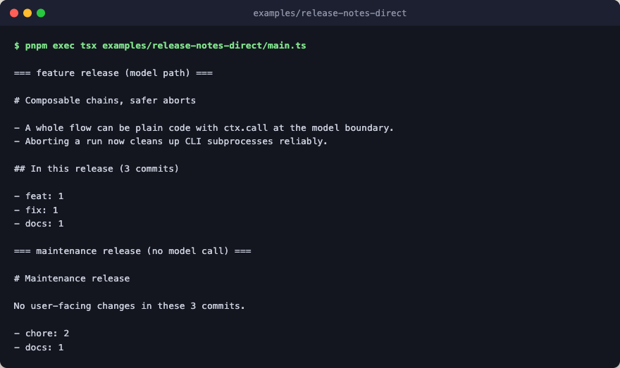

# release-notes-direct

The same agent as [release-notes](../release-notes/), written in the direct
style. Where release-notes declares its topology as a `chain`, this version
is one named `step` whose body is ordinary TypeScript: `const` bindings, an
`if`, an early return, and `ctx.call(writer, ...)` at the model boundary.
`ctx.call` keeps spans, abort, and error paths intact, so the trajectory
still shows the writer call nested under the step. The domain helpers
(parsing, grouping, the schema, the stub engine) are imported from the
sibling, so this file shows only what changes between the two styles.



The twist that earns the direct style here: the model boundary is
conditional. A release with no user-facing commits (no feat, no fix) renders
a maintenance note without any model call at all. A static composition cannot
express "this stage exists only for some inputs" this plainly; a plain body
can. When the topology is fixed, prefer the chain; when the control flow is
data, write the body.

## Run

```bash
pnpm exec tsx examples/release-notes-direct/main.ts
```
