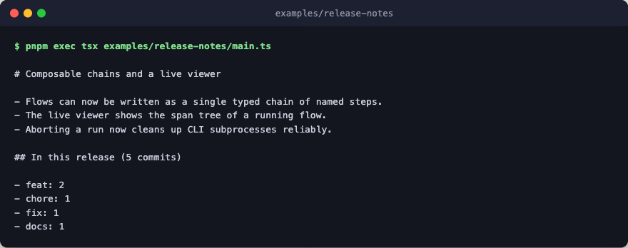

# release-notes

A whole agent in one file. The blueprint
([docs/blueprint.md](../../docs/blueprint.md)) describes the layered layout
for multi-role apps; this example is deliberately the other end of that
spectrum. One model role, so the system prompt is an inline string, the
schema sits beside it, and the whole topology is a single `chain` read top to
bottom. Reach for the layered layout when roles multiply or the prompt
deserves its own review surface, not before.



```text
chain
  ├ log      ← raw `git log --oneline` text
  ├ commits  ← parse hash + subject per line (pure)
  ├ grouped  ← bucket subjects by conventional-commit type (pure)
  ├ notes    ← writer (model_step via ctx.call, the only model boundary)
  └ output: render the release-notes markdown (pure)
```

The engine is a canned stub, so the example runs with no keys and no network;
swap `make_stub_engine()` for `create_engine({...})` to go live.

## Run

```bash
pnpm exec tsx examples/release-notes/main.ts
```
