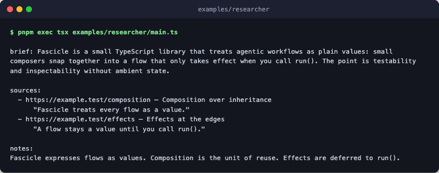

# researcher

A bespoke iterative agent driven by injected search and fetch. The example
wires the `researcher` agent against a stub engine plus mock `search` and
`fetch` functions: the engine returns one canned summarizer result, and the
mocks return a tiny in-memory corpus. This proves the abstraction end-to-end
without any network or API keys.



To drive it against real services, replace `make_stub_engine` with
`create_engine({...})` and provide real `search` / `fetch` implementations.
The agent definition itself is demo code in [`../agents/`](../agents/); copy
it alongside this example when porting it into your own project.

## Flow

The dispatcher builds its round loop at run time from `depth`, so the loop
draws as a second tree.

```text
researcher                compose: a cited brief from injected search and fetch
└─ researcher_dispatcher  size the loop for shallow depth, then call it

loop                         one round at shallow depth
├─ researcher_round          mock search, then fetch both hits from the corpus
│  └─ researcher_summarizer  the model call; a canned, schema-checked summary
└─ guard  researcher_guard   stop on has_enough or when no new hits turn up
```

## Run

```bash
pnpm exec tsx examples/researcher/main.ts
```
