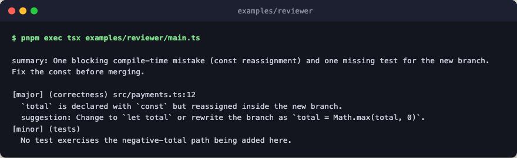

# reviewer

Structured code review against a stubbed engine. The example wires the
markdown-defined `reviewer` agent against a tiny in-process engine that
returns canned, schema-conforming output. No API keys, no network: it exists
to demonstrate how an agent factory plugs into the rest of Fascicle and
produces typed, structured findings.



Swap `make_stub_engine` for `create_engine({...})` from `fascicle` to drive
the same flow against a real provider. The agent definition itself is demo
code in [`../agents/`](../agents/); copy it alongside this example when
porting it into your own project.

## Run

```bash
pnpm exec tsx examples/reviewer/main.ts
```
