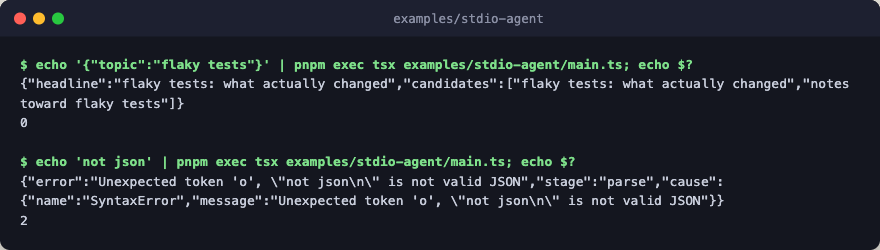

# stdio-agent

A compliant child under the stdio agent contract. A parent program spawns
[main.ts](./main.ts), writes JSON to its stdin, and reads one JSON result
from its stdout; trajectory goes to stderr, and the exit code is the verdict
(0 = result, 1 = flow failure, 2 = contract violation).



The steps are deterministic stubs with no engine and no network. A real agent
slots `model_call` steps into the same shape and passes its engine to
`run_stdio`, so it is disposed before the process exits.

## Flow

```text
sequence        the flow run_stdio feeds from stdin and writes to stdout
├─ parallel     draft two headlines for the topic at once
│  ├─ punchy    punchy headline draft, a stub for a model call
│  └─ measured  measured headline draft, a stub for a model call
└─ synthesize   lead with the punchy draft and keep both as candidates
```

## Run

```bash
echo '{"topic":"flaky tests"}' | pnpm exec tsx examples/stdio-agent/main.ts; echo $?
echo 'not json' | pnpm exec tsx examples/stdio-agent/main.ts; echo $?
```
