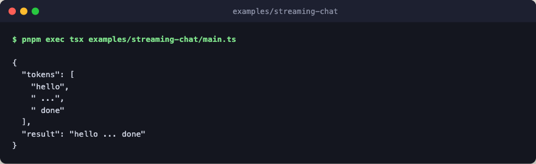

# streaming-chat

Observe token-like events through `run.stream()`. A step emits a small
sequence of chunks via `ctx.emit`, and the caller iterates the event stream
as the flow runs. The final result equals what plain `run(...)` would return.



Every step is a deterministic stub: no engine layer, no network, no LLM calls.

## Flow

```text
run.stream  start the flow on 'hello' and return a handle
├─ chat     stub step: emit three chunks, return them joined
├─ events   each emit reaches the caller while chat runs
└─ result   'hello ... done', what plain run would return
```

The flow itself is the one `chat` step, so this sketch draws the run around it.

## Run

```bash
pnpm exec tsx examples/streaming-chat/main.ts
```
