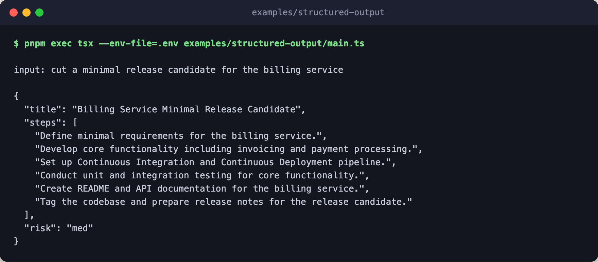

# structured-output

Constrain a model reply to a zod schema. The engine validates the reply
against `plan_schema`. If the first reply doesn't parse, the engine retries
up to `schema_repair_attempts` times before throwing
`schema_validation_error`; the caller catches that error to surface both the
raw text and the zod issue list.



## Flow

```text
engine          openrouter, openai/gpt-4o-mini by default
└─ model_step   one call whose reply must match plan_schema
   ├─ reply     the model answers the brief with JSON
   ├─ validate  parse the reply as { title, steps, risk }
   ├─ repair    send the zod issues back and parse again, 2 at most
   └─ result    the parsed plan, else schema_validation_error
```

The flow itself is one `model_step`, and the repair rounds run inside it.

## Run

Prereq: `OPENROUTER_API_KEY` exported, or set in the root `.env` (see
`.env.example`).

```bash
pnpm exec tsx --env-file=.env examples/structured-output/main.ts
pnpm exec tsx --env-file=.env examples/structured-output/main.ts "migrate the payments service to pg17"
```
