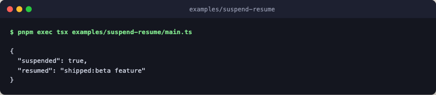

# suspend-resume

Human-in-the-loop pause and resume. `run.until_suspended` reports the pause
as a typed outcome, and calling the outcome's `resume(data)` re-runs the flow
with the decision, so the flow continues into `combine`.



Every step is a deterministic stub: no engine layer, no network, no LLM calls.

## Run

```bash
pnpm exec tsx examples/suspend-resume/main.ts
```
