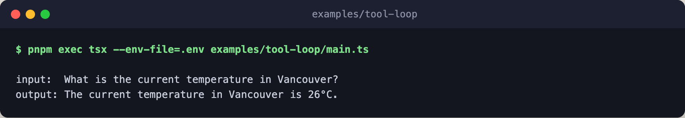

# tool-loop

Let the model call a tool and feed the result back. The example registers a
single `get_weather` tool that hits wttr.in, and the engine runs the
tool-calling loop: the model decides to call the tool, the engine invokes the
`execute` closure, the result is fed back, and the model produces a final
answer.



It uses the `openrouter` provider so the execute closure actually runs. Under
the `claude_cli` provider, `execute` tools with
`tool_bridge: 'allowlist_only'` are dropped in favor of the CLI's own
built-in tools, which is a different pattern.

## Flow

```text
engine             openrouter, openai/gpt-4o-mini by default
└─ model_step      the one call, with the tool loop inside it
   ├─ turn 1       the model asks for get_weather with a city
   ├─ get_weather  execute fetches the temperature from wttr.in
   ├─ turn 2       the model reads the result and answers
   └─ output       the final text once a turn calls no tool, 4 turns max
```

The flow itself is one `model_step`, and the tool loop runs inside that one
model boundary.

## Run

Prereq: `OPENROUTER_API_KEY` exported, or set in the root `.env` (see
`.env.example`).

```bash
pnpm exec tsx --env-file=.env examples/tool-loop/main.ts
pnpm exec tsx --env-file=.env examples/tool-loop/main.ts "What is the temperature in Oslo?"
```
