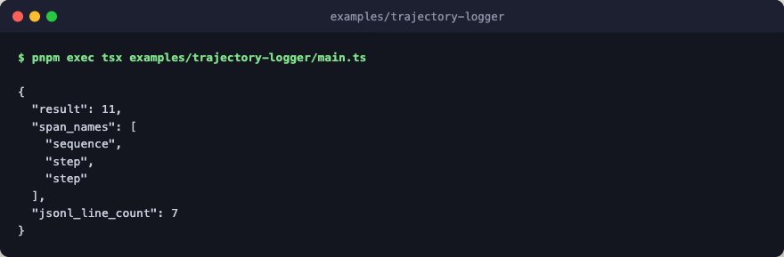

# trajectory-logger

Observe a run via `filesystem_logger` plus a custom sink. Two loggers are
wired into the same run: the packaged `filesystem_logger` writes one JSON
object per line to a file, and an in-memory `TrajectoryLogger` captures
events so the harness can assert on them. Composing loggers is a matter of
forwarding each call to both sinks, because the `TrajectoryLogger` type is a
plain object.



Every step is a deterministic stub: no engine layer, no network, no LLM calls.

## Run

```bash
pnpm exec tsx examples/trajectory-logger/main.ts
```
