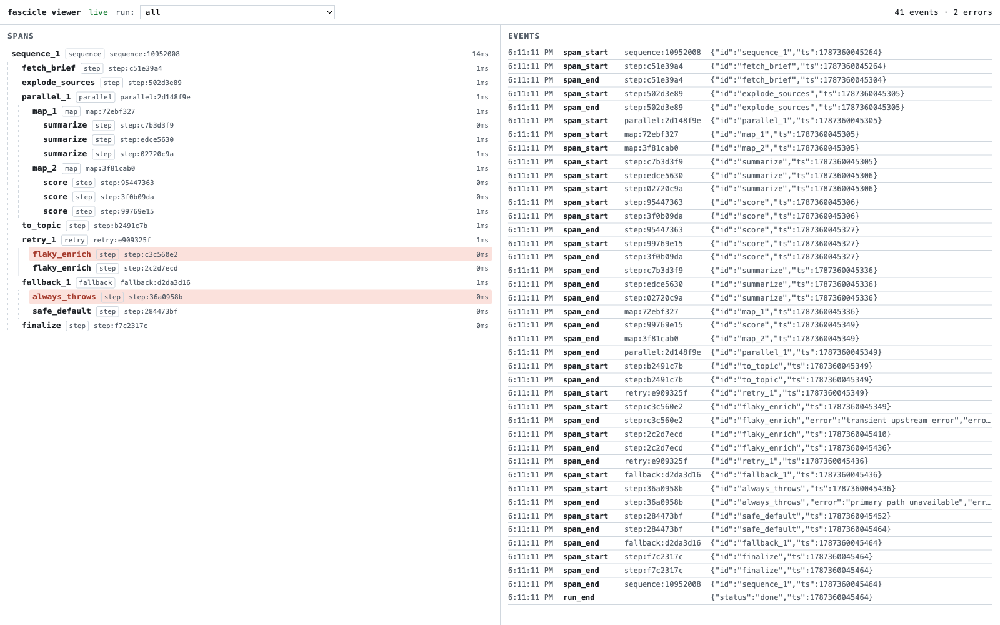

# viewer-demo

Produce a rich, deterministic `.trajectory.jsonl` for the viewer. The flow
exercises nested sequences, parallel branches, a retry that fails once before
succeeding, a map over a list, and a fallback that recovers from an error. No
engine layer, no network, no LLM calls.



## Run

```bash
pnpm exec tsx examples/viewer-demo/main.ts
pnpm exec fascicle-viewer .trajectory.jsonl
```

The first command writes the trajectory; the second serves the viewer on
localhost and opens the run above.
