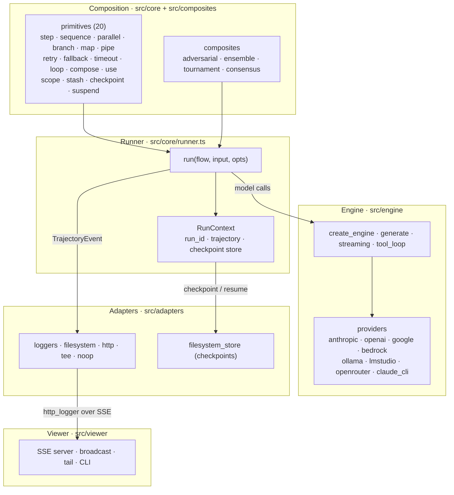
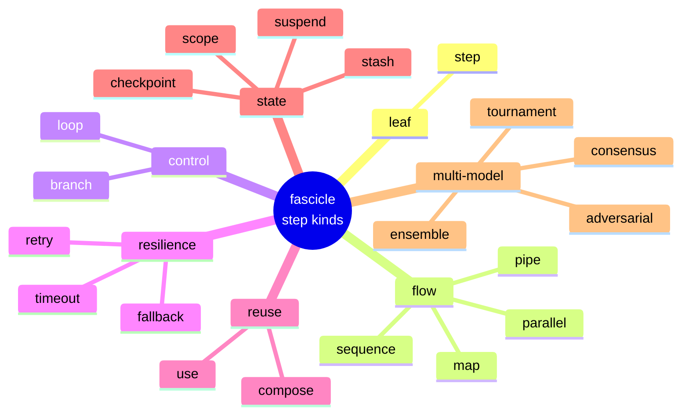
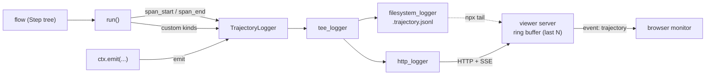

# Diagrams

Shared diagram sources for the research notes. Each diagram is a Mermaid
`.mmd` source file (the canonical, editable source) and is also embedded below
so it renders inline on GitHub.

Mermaid is the format on purpose: text-based, diffable, and LLM-editable, the
same properties the project values in the rest of the codebase. To export a
standalone SVG/PNG:

```sh
pnpm dlx @mermaid-js/mermaid-cli -i architecture-layers.mmd -o architecture-layers.svg
```

These describe the **current** `src/` layout, not the `packages/*` workspace
sketched in [`../papers/0001-studio-pdr.md`](../papers/0001-studio-pdr.md) (that
PDR is a snapshot of earlier thinking). When the code moves, move these with it.

## Architecture layers

How a fascicle harness is wired: the composition layer builds a `Step` tree,
the runner executes it while threading a `RunContext`, the engine handles model
calls across providers, and adapters fan events/checkpoints out to disk and the
viewer. Source: [`architecture-layers.mmd`](architecture-layers.mmd).



## Primitives taxonomy

The 20 entries of `STEP_KINDS` (`src/core/step_kinds.ts`) grouped by intent.
This is the closed registry the runner dispatches on and that a studio palette
would enumerate. Source: [`primitives-taxonomy.mmd`](primitives-taxonomy.mmd).



## Trajectory pipeline

How a trajectory event reaches a live monitor. The wire format
(`src/core/trajectory.ts`) is an ordered union — `span_start`, `span_end`,
`emit`, then a permissive `custom` fallthrough — and `tee_logger` fans every
event to both the filesystem and the SSE viewer. Source:
[`trajectory-pipeline.mmd`](trajectory-pipeline.mmd).


